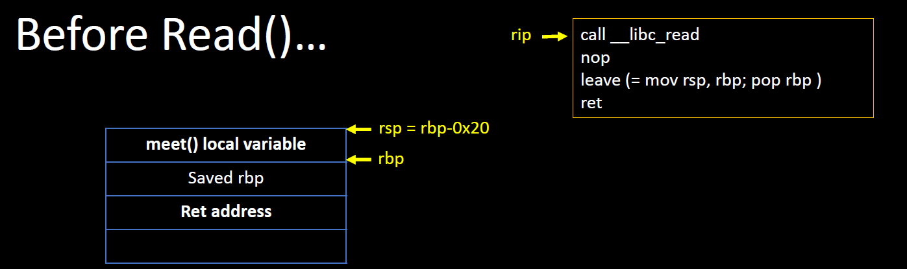
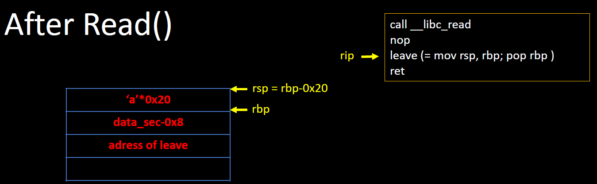
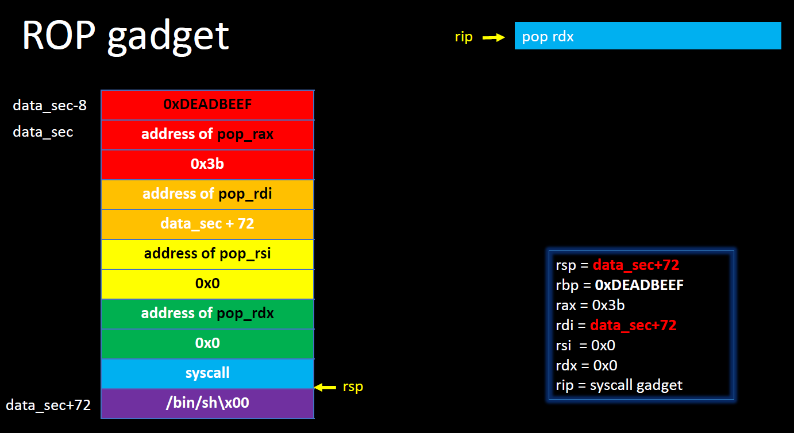

# Stack Migration
**Stack Migration** 指 ROP (Return Oriented Programming) 的一種技巧，可在當 stack 不夠使用時，利用 ROP 控制來竄改 `stack pointer (esp or rsp)`，指向其他位址，以獲取額外的寫入空間。 <br>

範例原始碼
```C=
#include <stdio.h>
#include <unistd.h>

char nothing[128] = "";

void meet() {
    char something[32];
    printf("What are you looking for? ");
    read(0, something, 128);
    return;
}

int main() {
    setvbuf(stdout, 0, 2, 0);
    setvbuf(stdin, 0, 2, 0);
    printf("What are you looking for? ");
    fflush(stdout);
    read(0, nothing, 128);
    
    meet();
    return 0;
}
```

看完原始碼後，預設此程式沒有開啟 canary 保護，<br>

Compile & Static Linking
```sh
gcc lab.c -fno-stack-protector -no-pie -static -o lab
```
option 解釋如下：[1]
* `-fno-stack-protector`： 關閉 stack 保護，也就是 stack section 無 canary，反之若要開啟則要使用下列選項擇一：
    * `-fstack-protector`：簡單來說，只要該 function 有呼叫及使用到 8 bytes 大小以上的 variable 及 array，就必須開啟保護。
    * `-fstack-protector-strong`：只要該 function 符合下列條件之一，就會開啟 stack 保護
        1. 有宣告 array，不論型態大小
        2. 有呼叫到 `alloca()`
        3. 得知 local variable 位址
    * `-fstack-protector-all`：所有 function 開啟 stack 保護。

* `-no-pie`：關閉 text section 隨機位址化之保護 <br>

* `-static`：靜態編譯，在 run-time 階段不連接 library，而是在編譯時期直接將程式碼加到原先的程式上。

檢查此執行檔是否為靜態連結
```sh
sophie@ubuntu:~$ file lab
lab: ELF 64-bit LSB executable, x86-64, version 1 (GNU/Linux), statically linked, for GNU/Linux 3.2.0, BuildID[sha1]=00e8fa1c190976415122964b574f5c8a3c7aba29, not stripped
```

使用 `checksec` 檢查確認有哪些保護關閉
```
    Arch:     amd64-64-little
    RELRO:    Partial RELRO
    Stack:    No canary found
    NX:       NX enabled
    PIE:      No PIE (0x400000)
```


因為沒有 stack 保護，我們可以使用 bof 來突破 stack 的寫入空間，<br>
並且將原先的 retrun address 竄改成 `leave ; ret` 的 gadget 位址，<br>
只要執行到 `ret` 指令時，就會將 program counter (rip) 指向 `leave ; ret` 之位址，<br>
就能夠透過 leave 的 `mov rsp, rbp ; pop rbp` 來竄改原先的 `rsp`. <br><br>
以下圖為例子，當 `rip` 指向 leave 並執行之後，便會將 `rbp = data_sec-0x8` 賦值給 `rsp`<br>
再執行 `pop rbp;`， `rbp` 就會等於 `0xDEADBEEF` （此時 `rbp`已經沒有利用價值，因此隨便給值即可) <br>
而 `rsp` 因為 `pop` 值而變成 `data_sec`，此時便成功將 stack *migration* 到 data section <br><br> 
輸入 Payload 之前 <br>
<br>
輸入 Payload 之後 <br>
<br>
stack pointer 指向新的位置於 data section<br>


## Reference
1. [stack protector](http://www.keil.com/support/man/docs/armclang_ref/armclang_ref_cjh1548250046139.htm)